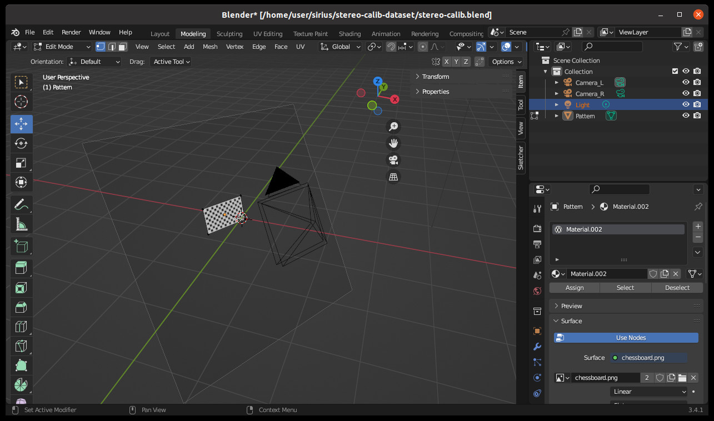
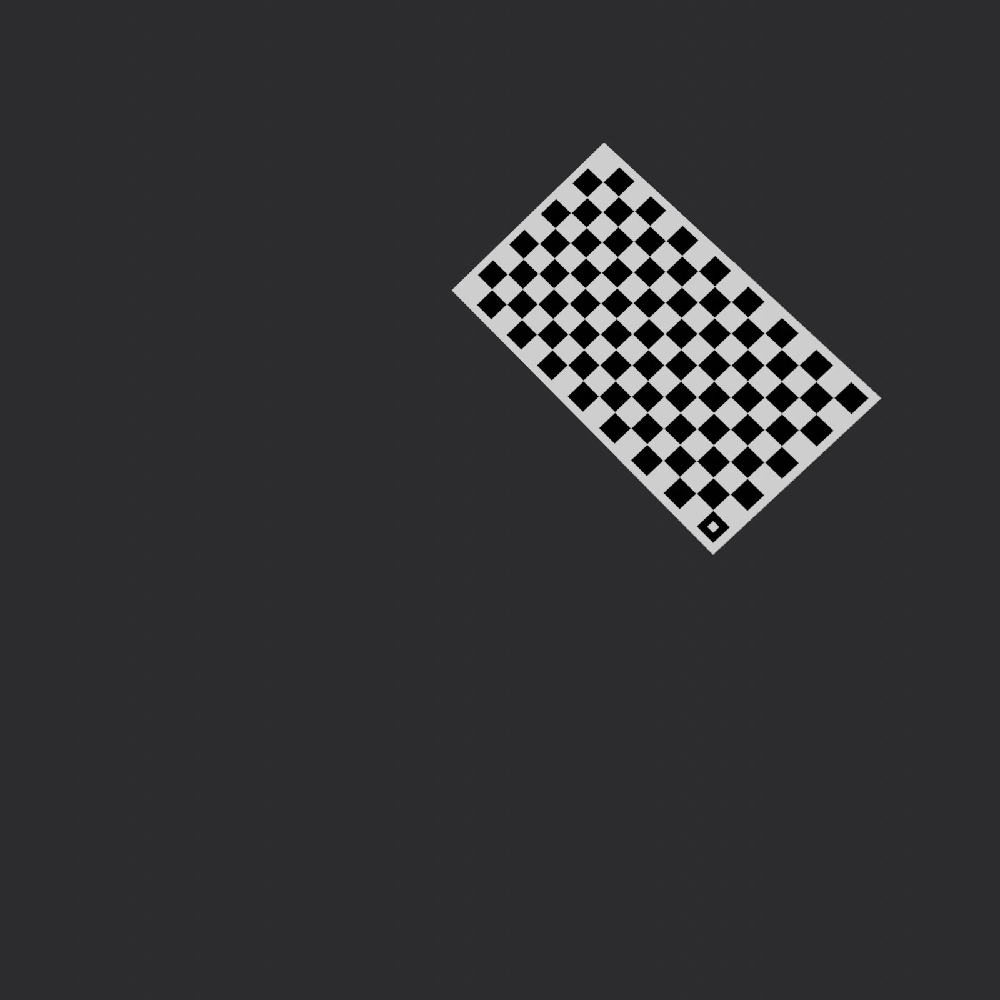
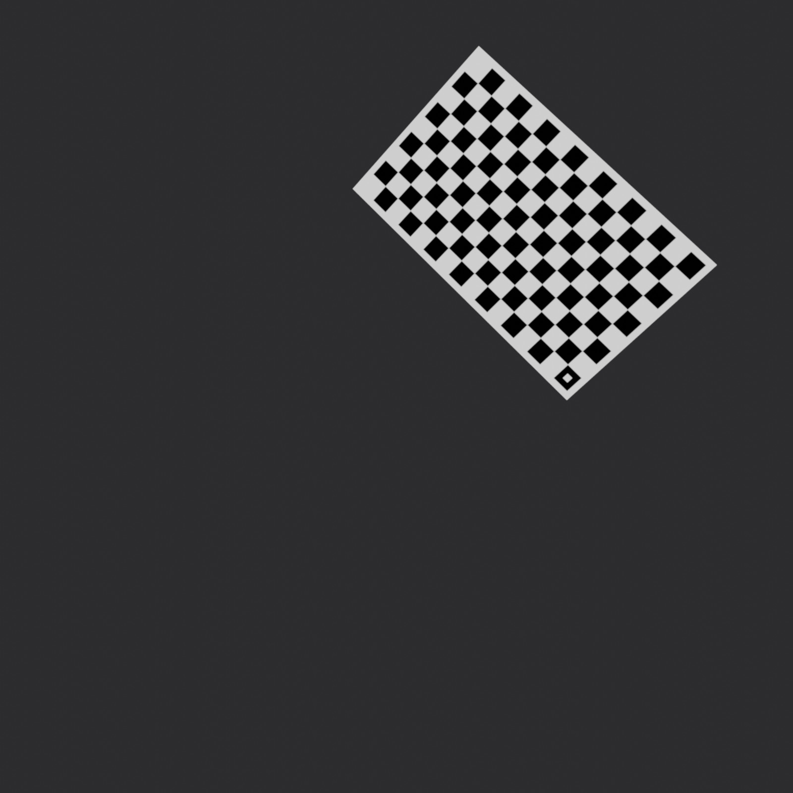

# Dataset generator for testing stereo camera calibration algorithm



The project includes blender scene and scripts which render the scene for 2 cameras, logdown metadata including cameras intrinsics as well as chessboard pattern poses.

The rendered images are written to `/tmp/calib`

|  |  |
| :---: | :---: |
|  Left | Right |

as well as metadata file `parameters.json`

```json
{
  "left": {
    "intrinsics": [
      [711.1111111111111, 0, 800.0],
      [0, 711.1111111111111, 800.0],
      [0, 0, 1]
    ],
    "position": [1.9740146398544312, 2.0286037921905518, -1.4990243911743164],
    "orientation": [0.7467635454245646, 0.4660553210498401, -0.24530256456840102, -0.40615673915648615]
  },
  "right": {
    "intrinsics": [
      [711.1111111111111, 0, 800.0],
      [0, 711.1111111111111, 800.0],
      [0, 0, 1]
    ],
    "position": [2.0268373489379883, 1.9699028730392456, -1.4995173215866089],
    "orientation": [0.7648059950974458, 0.413091646151534, -0.2541481007558753, -0.424070542038707]
  },
  "pattern": {
    "width": 0.5,
    "height": 0.28999999165534973,
    "pose": [
      {
        "position": [
          0.5746309879092697,
          1.7678786182885884,
          -0.7856272430083373
        ],
        "orientation": [
          0.33749784939733796,
          0.5356452486425296,
          0.033163292257880284,
          -0.7733560404532138
        ]
      },
      ...
    ]
  }
}
```

All the coordinates are given in world coordinate system frame with basis vectors x,y,z directed to Right Forward Down (FRD convention).
